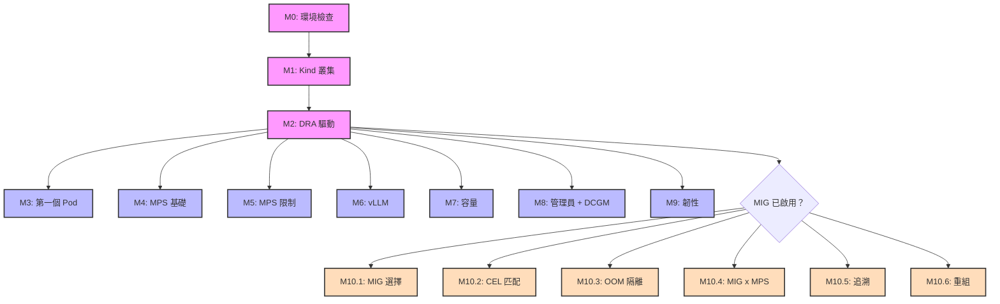

# Kubernetes x NVIDIA DRA 工作坊

提供 Kubernetes 工程師在本地 Kind 叢集上實作 **Dynamic Resource Allocation (DRA)** 與 NVIDIA GPU 的完整實戰工作坊。

涵蓋：獨佔式 GPU 排程、MPS 共享、MIG 硬體隔離、MIG x MPS 混合架構、管理員存取、可觀測性、韌性測試。

> **[English README](README.md)**

## 前置需求

| 工具 | 用途 | 驗證指令 |
|------|------|---------|
| NVIDIA Driver 550+ | GPU 驅動 | `nvidia-smi` |
| Docker | 容器執行環境 | `docker ps` |
| Kind v0.24+ | 本地 K8s 叢集 | `kind version` |
| Helm 3 | DRA 驅動安裝 | `helm version` |
| nvidia-ctk | CDI 設定 | `nvidia-ctk cdi list` |

```bash
./scripts/phase1/run-module0-check-env.sh   # 自動檢查
```

## 工作坊模組

### Phase 1：DRA 基礎與 MPS 共享

| 模組 | 主題 | 腳本 | 文件 |
|------|------|------|------|
| M0 | 環境檢查 | `run-module0-check-env.sh` | [連結](docs/phase1/00-prerequisites.md) |
| M1 | Kind 叢集建置 | `run-module1-setup-kind.sh` | [連結](docs/phase1/01-kind-setup.md) |
| M2 | DRA 驅動安裝 | `run-module2-install-driver.sh` | [連結](docs/phase1/02-driver-install.md) |
| M3 | 第一個 GPU Pod | `run-module3-verify-workload.sh` | [連結](docs/phase1/03-workloads.md) |
| M4 | MPS 基礎（DRA 託管） | `run-module4-mps-basics.sh` | [連結](docs/phase1/04-mps-basics.md) |
| M5 | MPS 資源限制 | `run-module5-mps-advanced.sh` | [連結](docs/phase1/05-mps-advanced.md) |
| M6 | vLLM on MPS | `run-module6-vllm-verify.sh` | [連結](docs/phase1/06-vllm-mps.md) |

### Phase 2：生產就緒

| 模組 | 主題 | 腳本 | 文件 |
|------|------|------|------|
| M7 | 可消耗容量（Alpha） | `run-module7-consumable-capacity.sh` | [連結](docs/phase2/07-consumable-capacity.md) |
| M8 | 管理員存取（Beta） | `run-module8-admin-access.sh` | [連結](docs/phase2/08-admin-access.md) |
| M8 | 可觀測性（DCGM via adminAccess） | `run-module8-observability.sh` | [連結](docs/phase2/08-admin-access.md) |
| M9 | 韌性測試（Chaos） | `run-module9-resilience.sh` | [連結](docs/phase2/09-resilience.md) |

### Phase 3：MIG 硬體隔離（僅限 A100/H100）

| 模組 | 主題 | 腳本 | 文件 |
|------|------|------|------|
| M10.1 | MIG 配置選擇 | `module10-1/run.sh` | [連結](docs/phase3/10.1-mig-dra-abstraction.md) |
| M10.2 | CEL 容量匹配 | `module10-2/run.sh` | [連結](docs/phase3/10.2-auto-resource-matching.md) |
| M10.3 | OOM 隔離驗證 | `module10-3/run.sh` | [連結](docs/phase3/10.3-mig-isolation-experiment.md) |
| M10.4 | MIG x MPS 混合 | `module10-4/run.sh` | [連結](docs/phase3/10.4-mig-x-mps.md) |
| M10.5 | 矽晶片到 Pod 追溯 | `module10-5/run.sh` | [連結](docs/phase3/10.5-mig-x-observability.md) |
| M10.6 | 動態 MIG 重組 | `module10-6/run.sh` | [連結](docs/phase3/10.6-dynamic-reconfig.md) |

## 快速開始

```bash
# 初始設定（執行一次）
./scripts/phase1/run-module0-check-env.sh
./scripts/phase1/run-module1-setup-kind.sh
./scripts/phase1/run-module2-install-driver.sh

# 任意順序執行模組（M3-M9）
./scripts/phase1/run-module3-verify-workload.sh
./scripts/phase2/run-module8-admin-access.sh    # 不限順序

# 執行全部
./run_all.sh

# MIG 模式（僅 A100/H100）
sudo ./scripts/common/mig-reconfig.sh mig       # 啟用 MIG
./scripts/phase3/module10-1/run.sh               # 執行 MIG 模組
sudo ./scripts/common/mig-reconfig.sh gpu        # 還原完整 GPU 模式
```

## 模組獨立性

初始設定完成後（M0 → M1 → M2），**M3-M9 的每個模組都是獨立的**，可以任意順序執行。每個模組會引用共用的 [`ensure-ready.sh`](scripts/common/ensure-ready.sh)，自動完成：

- 確認驅動 Pod 正在執行
- 視需要啟用 MPSSupport feature gate
- 清理前一模組殘留的 DeviceClass、Pod、ResourceClaim、MPS daemon
- 等待 ResourceSlice 就緒

## 模組依賴圖



## 測試環境

| | 配置 |
|---|---|
| **GPU** | NVIDIA A100-PCIE-40GB（MIG）、RTX 5090（MPS/vLLM） |
| **OS** | Ubuntu 22.04 LTS, Kernel 5.15+ |
| **驅動** | NVIDIA Driver 550+ |
| **K8s** | Kind v0.24+（K8s v1.32–1.34），啟用 DRA feature gates |
| **DRA 驅動** | `nvcr.io/nvidia/k8s-dra-driver-gpu:v25.8.1` |

## 技術亮點

- **DRA 託管 MPS**：無需 `hostIPC` 的 GPU 共享——驅動自動為每個 Claim 建立獨立的 MPS daemon
- **Kind 相容性**：`COPY_DRIVER_LIBS_FROM_ROOT` 機制解決 Kind 叢集缺少 NVIDIA container runtime 時的 NVML 函式庫探索問題
- **硬體隔離**：MIG 分區提供獨立的記憶體控制器與 SM
- **MIG x MPS 混合**：切片之間硬體隔離 + 切片內部軟體共享
- **韌性設計**：CDI 解耦使驅動/控制器重啟不影響執行中的工作負載
- **管理員存取**：`adminAccess: true` 繞過 GPU 獨佔鎖定，用於除錯已滿載的節點

## 疑難排解

如果任何模組執行異常，請先執行 `reset-env`：

```bash
./scripts/common/reset-env.sh       # 清理所有資源 + 刷新 DRA plugin（保留叢集）
```

這能解決大多數問題（stale claim、過期的 plugin socket、殘留的 DeviceClass）。詳見完整[疑難排解指南](docs/troubleshooting_zh.md)。

## 清理

```bash
./scripts/common/run-teardown.sh    # 銷毀 Kind 叢集
```
