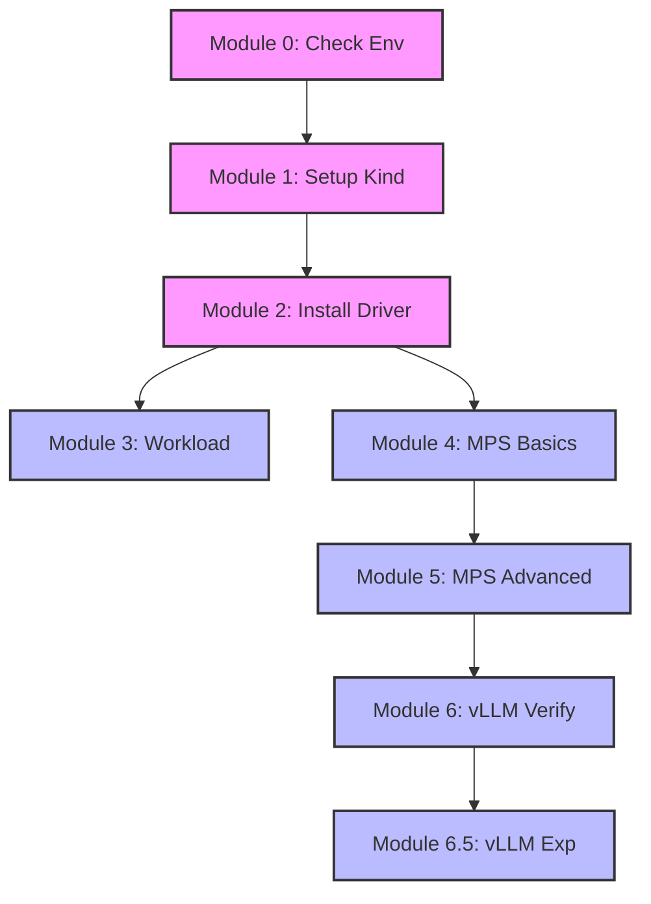

# k8s x NVIDIA DRA (Structured Parameters) on Kind Workshop

歡迎來到 k8s x NVIDIA DRA 工作坊！

本工作坊旨在協助 Kubernetes 工程師與開發者，在本地 Kind 環境中快速體驗並驗證 **Dynamic Resource Allocation (DRA)** 的 ResourceSlice 與 Structured Parameters 等機制。

## Phase 1: Basic Setup & MPS Integration
Phase 1 focuses on establishing a functional DRA environment with **MPS (Spatial Sharing)** support.

| Module | Topic                                              | Description                                 |
| :----- | :------------------------------------------------- | :------------------------------------------ |
| **00** | [Prerequisites](docs/phase1/00-prerequisites.md)   | Check Host Driver, Docker, and CDI config.  |
| **01** | [Kind Setup](docs/phase1/01-kind-setup.md)         | Build Kind with **In-Cluster MPS** support. |
| **02** | [Driver Install](docs/phase1/02-driver-install.md) | Deploy NVIDIA DRA Driver & Node Agent.      |
| **03** | [Workloads](docs/phase1/03-workloads.md)           | Verify basic exclusive GPU scheduling.      |
| **04** | [MPS Basics](docs/phase1/04-mps-basics.md)         | Enable Spatial Sharing (IPC Connectivity).  |
| **05** | [MPS Advanced](docs/phase1/05-mps-advanced.md)     | Verify Resource Limits (Thread % & Memory). |
| **06** | [vLLM Verification](docs/phase1/06-vllm-mps.md)    | Verify vLLM with MPS (Basic Check).         |
| **06.5** | [vLLM Experiment](docs/phase1/06-vllm-experiment.md) | Sensitivity Analysis (MPS Impact).          |

### Phase 2: Advanced Resource Management (Modules 7-9)

| # | Module Name | Manifests | Scripts | Docs |
| :--- | :--- | :--- | :--- | :--- |
| 07 | Consumable Capacity | `demo-shared-capacity.yaml` | `run-module7-consumable-capacity.sh` | [Link](docs/phase2/07-consumable-capacity.md) |
| 08 | Admin Access & Observability | `dcgm-exporter.yaml` | `run-module8-admin-access.sh` | [Link](docs/phase2/08-admin-access.md) |
| 09 | Resilience & Recovery | `demo-mps-limits.yaml` | `run-module9-resilience.sh` | [Link](docs/phase2/09-resilience.md) |

## Module Dependencies



## Quick Start
```bash
# 1. Check Environment
./scripts/phase1/run-module0-check-env.sh

# 2. Setup Cluster
./scripts/phase1/run-module1-setup-kind.sh

# 3. Install Driver
./scripts/phase1/run-module2-install-driver.sh

# 4. Run All Verifications
./scripts/phase1/run-module3-verify-workload.sh
./scripts/phase1/run-module4-mps-basics.sh
./scripts/phase1/run-module5-mps-advanced.sh
./scripts/phase1/run-module6-vllm-verify.sh
```

## Phase 1 Verification Results (Empirical)
We verified the MPS implementation with rigorous benchmarks using the following **Test Environment**:
- **Hardware**: NVIDIA GeForce RTX 4090 (24GB)
- **Host**: Ubuntu 22.04 LTS, Kernel 5.15+
- **Driver**: NVIDIA Driver 550+
- **Kubernetes**: Kind v0.24.0 (K8s v1.32.0) with DRA Feature Gates enabled

**Key Findings:**
- **Extreme Throttling (1% Limit)**: Throughput dropped from **5.29 TFLOPS** (100%) to **0.078 TFLOPS** (1%), confirming ~68x hardware-level throttling.
- **Fair Competition**: Three pods (each 20%) achieved identical throughput (~0.86 TFLOPS each) under heavy contention.
- **Memory Hard Limit**: Applications exceeding `CUDA_MPS_PINNED_DEVICE_MEM_LIMIT` are immediately terminated with OOM.


## Technical Highlights
- **In-Cluster MPS Architecture**: Runs the MPS control daemon *inside* the Kind node to resolve IPC namespace isolation issues.
- **Dynamic Library Discovery**: Automatically finds and mounts Host NVIDIA libraries (including `libnvidia-ptxjitcompiler`) into the Kind node.
- **Latest DRA API**: Supports Kubernetes `resource.k8s.io/v1` (Stable/Beta) APIs.

## Cleanup
```bash
./scripts/common/run-teardown.sh
```

> [!TIP]
> Encountering issues? Check the [Troubleshooting Guide](docs/troubleshooting.md).
