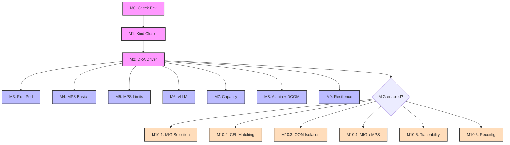

# Kubernetes x NVIDIA DRA Workshop

A hands-on workshop for Kubernetes engineers to explore **Dynamic Resource Allocation (DRA)** with NVIDIA GPUs on Kind clusters.

Covers the full stack: exclusive GPU scheduling, MPS sharing, MIG hardware isolation, MIG x MPS hybrid architecture, admin access, observability, and resilience testing.

> **[繁體中文版 README](README-zh_TW.md)**

## Prerequisites

| Tool | Purpose | Verify |
|------|---------|--------|
| NVIDIA Driver 550+ | GPU driver | `nvidia-smi` |
| Docker | Container runtime | `docker ps` |
| Kind v0.24+ | Local K8s cluster | `kind version` |
| Helm 3 | DRA driver install | `helm version` |
| nvidia-ctk | CDI config | `nvidia-ctk cdi list` |

```bash
./scripts/phase1/run-module0-check-env.sh   # Automated check
```

## Workshop Modules

### Phase 1: DRA Basics & MPS Sharing

| Module | Topic | Script | Docs |
|--------|-------|--------|------|
| M0 | Prerequisites Check | `run-module0-check-env.sh` | [Link](docs/phase1/00-prerequisites.md) |
| M1 | Kind Cluster Setup | `run-module1-setup-kind.sh` | [Link](docs/phase1/01-kind-setup.md) |
| M2 | DRA Driver Install | `run-module2-install-driver.sh` | [Link](docs/phase1/02-driver-install.md) |
| M3 | First GPU Pod | `run-module3-verify-workload.sh` | [Link](docs/phase1/03-workloads.md) |
| M4 | MPS Basics (DRA-managed) | `run-module4-mps-basics.sh` | [Link](docs/phase1/04-mps-basics.md) |
| M5 | MPS Resource Limits | `run-module5-mps-advanced.sh` | [Link](docs/phase1/05-mps-advanced.md) |
| M6 | vLLM on MPS | `run-module6-vllm-verify.sh` | [Link](docs/phase1/06-vllm-mps.md) |

### Phase 2: Production Readiness

| Module | Topic | Script | Docs |
|--------|-------|--------|------|
| M7 | Consumable Capacity (Alpha) | `run-module7-consumable-capacity.sh` | [Link](docs/phase2/07-consumable-capacity.md) |
| M8 | Admin Access (Beta) | `run-module8-admin-access.sh` | [Link](docs/phase2/08-admin-access.md) |
| M8 | Observability (DCGM via adminAccess) | `run-module8-observability.sh` | [Link](docs/phase2/08-admin-access.md) |
| M9 | Resilience (Chaos) | `run-module9-resilience.sh` | [Link](docs/phase2/09-resilience.md) |

### Phase 3: MIG Hardware Isolation (A100/H100 only)

| Module | Topic | Script | Docs |
|--------|-------|--------|------|
| M10.1 | MIG Profile Selection | `module10-1/run.sh` | [Link](docs/phase3/10.1-mig-dra-abstraction.md) |
| M10.2 | CEL Capacity Matching | `module10-2/run.sh` | [Link](docs/phase3/10.2-auto-resource-matching.md) |
| M10.3 | OOM Isolation Proof | `module10-3/run.sh` | [Link](docs/phase3/10.3-mig-isolation-experiment.md) |
| M10.4 | MIG x MPS Hybrid | `module10-4/run.sh` | [Link](docs/phase3/10.4-mig-x-mps.md) |
| M10.5 | Silicon-to-Pod Traceability | `module10-5/run.sh` | [Link](docs/phase3/10.5-mig-x-observability.md) |
| M10.6 | Dynamic MIG Reconfiguration | `module10-6/run.sh` | [Link](docs/phase3/10.6-dynamic-reconfig.md) |

## Quick Start

```bash
# Setup (run once)
./scripts/phase1/run-module0-check-env.sh
./scripts/phase1/run-module1-setup-kind.sh
./scripts/phase1/run-module2-install-driver.sh

# Run any module independently (M3-M9)
./scripts/phase1/run-module3-verify-workload.sh
./scripts/phase2/run-module8-admin-access.sh    # order doesn't matter

# Run everything
./run_all.sh

# MIG mode (A100/H100 only)
sudo ./scripts/common/mig-reconfig.sh mig       # enable MIG
./scripts/phase3/module10-1/run.sh               # run MIG modules
sudo ./scripts/common/mig-reconfig.sh gpu        # restore full GPU mode
```

## Module Independence

After initial setup (M0 → M1 → M2), **every module (M3-M9) is self-contained** and can be run in any order. Each module sources a shared [`ensure-ready.sh`](scripts/common/ensure-ready.sh) helper that:

- Verifies driver pods are running
- Enables the MPSSupport feature gate if needed
- Cleans stale DeviceClasses, pods, claims, and MPS daemons from prior modules
- Waits for ResourceSlice availability

## Module Dependency Graph


```mermaid
graph TD
    M0[M0: Check Env] --> M1[M1: Kind Cluster]
    M1 --> M2[M2: DRA Driver]
    M2 --> M3[M3: First Pod]
    M2 --> M4[M4: MPS Basics]
    M2 --> M5[M5: MPS Limits]
    M2 --> M6[M6: vLLM]
    M2 --> M7[M7: Capacity]
    M2 --> M8[M8: Admin + DCGM]
    M2 --> M9[M9: Resilience]
    M2 --> MIG{MIG enabled?}
    MIG --> M10.1[M10.1: MIG Selection]
    MIG --> M10.2[M10.2: CEL Matching]
    MIG --> M10.3[M10.3: OOM Isolation]
    MIG --> M10.4[M10.4: MIG x MPS]
    MIG --> M10.5[M10.5: Traceability]
    MIG --> M10.6[M10.6: Reconfig]

    classDef infra fill:#f9f,stroke:#333,stroke-width:2px
    classDef workload fill:#bbf,stroke:#333,stroke-width:2px
    classDef mig fill:#fdb,stroke:#333,stroke-width:2px
    class M0,M1,M2 infra
    class M3,M4,M5,M6,M7,M8,M9 workload
    class M10.1,M10.2,M10.3,M10.4,M10.5,M10.6 mig
```

## Test Environment

| | Config |
|---|---|
| **GPU** | NVIDIA A100-PCIE-40GB (MIG), RTX 5090 (MPS/vLLM) |
| **OS** | Ubuntu 22.04 LTS, Kernel 5.15+ |
| **Driver** | NVIDIA Driver 550+ |
| **K8s** | Kind v0.24+ (K8s v1.32–1.34) with DRA feature gates |
| **DRA Driver** | `nvcr.io/nvidia/k8s-dra-driver-gpu:v25.8.1` |

## Key Technical Highlights

- **DRA-managed MPS**: GPU sharing without `hostIPC` — the driver creates per-claim MPS daemons automatically
- **Kind compatibility**: `COPY_DRIVER_LIBS_FROM_ROOT` mechanism solves NVML library discovery on Kind clusters without NVIDIA container runtime
- **Hardware isolation**: MIG partitioning provides independent memory controllers and SMs per slice
- **MIG x MPS hybrid**: Hardware isolation between slices + software sharing within each slice
- **Resilience by design**: CDI decoupling means driver/controller restarts don't kill running workloads
- **Admin Access**: `adminAccess: true` bypasses GPU exclusivity for debugging fully-allocated nodes

## Troubleshooting

If any module fails unexpectedly, run `reset-env` first:

```bash
./scripts/common/reset-env.sh       # clean all resources + refresh DRA plugin (keeps cluster)
```

This resolves most issues (stale claims, expired plugin sockets, leftover DeviceClasses). See the full [Troubleshooting Guide](docs/troubleshooting.md) for details.

## Cleanup

```bash
./scripts/common/run-teardown.sh    # destroy Kind cluster
```
