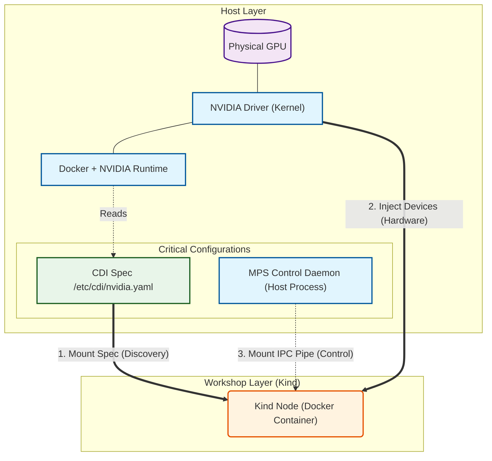

# Module 0: Prerequisites & Environment Setup

## 1. Overview
This module ensures your environment is prepared for the NVIDIA Dynamic Resource Allocation (DRA) Workshop.
Unlike standard Kubernetes GPU setups (Device Plugins), DRA relies on a more modern stack involving **CDI (Container Device Interface)** and specific kernel capabilities.

### System Architecture
The following diagram illustrates the dependencies for our "In-Cluster MPS" Lab setup:



## 2. Hardware & OS Requirements
- **Operating System**: Linux (Ubuntu 22.04 LTS recommended)
- **Kernel version**: 5.15+ (Optimal for eBPF and latest container runtimes)
- **GPU Architecture**: Pascal (GTX 10-series) or newer.
- **Compute Capability**: 6.0+ (Required for MPS)

## 3. Essential Software Stack

| Component         | Version | Installation Guide                                                                                             | Role in Workshop                                                                            |
| :---------------- | :------ | :------------------------------------------------------------------------------------------------------------- | :------------------------------------------------------------------------------------------ |
| **Docker**        | 24.0+   | [Official Guide](https://docs.docker.com/engine/install/)                                                      | Container Runtime. Must assume `nvidia-container-runtime` as default or configured runtime. |
| **Kind**          | 0.24.0+ | [Quick Start](https://kind.sigs.k8s.io/docs/user/quick-start/)                                                 | Simulates a Kubernetes Cluster using Docker containers.                                     |
| **Helm**          | 3.10+   | [Install Helm](https://helm.sh/docs/intro/install/)                                                            | Package manager for installing the DRA Driver.                                              |
| **NVIDIA Driver** | 535+    | [Download Drivers](https://www.nvidia.com/Download/index.aspx)                                                 | The kernel-level driver. **Crucial**: Must support the GPU model.                           |
| **NVIDIA CTK**    | 1.14+   | [Install Toolkit](https://docs.nvidia.com/datacenter/cloud-native/container-toolkit/latest/install-guide.html) | Generates the CDI specification required by the DRA driver to discover GPUs.                |

## 4. Configuration Details

### 4.1. NVIDIA Container Toolkit (CDI)
The DRA driver deprecates the old method of "mounting `/dev/nvidiaX`". Instead, it uses **CDI**.
You must generate the spec file on the **Host**:

```bash
# 1. Install Toolkit
sudo apt-get update && sudo apt-get install -y nvidia-container-toolkit

# 2. Configure Docker Runtime
sudo nvidia-ctk runtime configure --runtime=docker
sudo systemctl restart docker

# 3. Generate CDI Spec (CRITICAL)
sudo nvidia-ctk cdi generate --output=/etc/cdi/nvidia.yaml
```

> **Why CDI?**
> CDI allows the runtime to inject devices based on a standard JSON/YAML spec, decoupling the device discovery from the specific container runtime (Docker, Containerd, CRI-O).

### 4.2. MPS Host Daemon
For this workshop, to simulate a production environment within Kind, we use a "Host-Pass-Through" pattern for MPS.
- **Requirement**: The Host must have `nvidia-cuda-mps-control` installed.
- **Setup**: The Kind node will mount `/tmp/nvidia-mps` from the host.

## 5. Verification Script
We provide an automated script to validate all above requirements.

**Command:**
```bash
./scripts/phase1/run-module0-check-env.sh
```

**Success Criteria:**
- [x] Docker NVIDIA runtime detected.
- [x] MPS Control Daemon is running (or ready to start).
- [x] CDI spec found at `/etc/cdi/nvidia.yaml`.

## 6. Troubleshooting

### "NVIDIA-SMI failed" inside Docker
*   **Cause**: Docker not using NVIDIA runtime.
*   **Fix**: Check `/etc/docker/daemon.json` for `"default-runtime": "nvidia"` or ensure you run checks with `--gpus all`.

### "CDI spec not found"
*   **Cause**: `nvidia-ctk cdi generate` was never run.
*   **Impact**: The DRA driver will start but see **0 GPUs**.

### "MPS Control Daemon not running"
*   **Cause**: The background process isn't started on the host.
*   **Fix**: Run `nvidia-cuda-mps-control -d`.

## 7. Official References
- [NVIDIA Container Toolkit Installation](https://docs.nvidia.com/datacenter/cloud-native/container-toolkit/latest/install-guide.html)
- [NVIDIA Container Device Interface (CDI) Support](https://docs.nvidia.com/datacenter/cloud-native/container-toolkit/latest/cdi-support.html)
- [NVIDIA K8s Device Plugin vs. DRA](https://github.com/NVIDIA/k8s-dra-driver)
