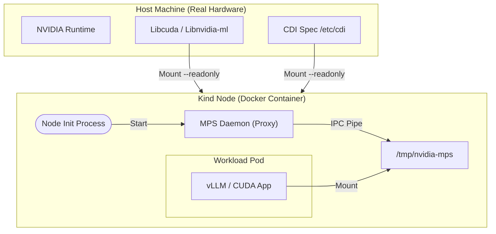

# Module 1: Kind Cluster Setup (In-Cluster MPS Architecture)

## 1. Overview
In this module, we construct a specialized Kubernetes cluster capable of **In-Cluster MPS**.
Standard Kind clusters are "Docker-in-Docker" environments. They isolate the Node from the Host's GPU runtime. To enable high-performance spatial sharing (MPS), we must surgically break this isolation.

## 2. Architecture: "The Fake Daemon" Pattern

Kubernetes Pods communicate with MPS via shared memory (`/dev/shm`) and specific IPC pipes (`/tmp/nvidia-mps`).
In a Kind environment, we face a **Namespace Gap**:
- **Host MPS**: Runs in Host PID/IPC namespace.
- **Kind Node**: Runs in Docker Container namespace.
- **Pod**: Runs in Container namespace (inside Kind).

To bridge this, we implement the **Pass-through Architecture**:



## 3. Implementation Logic

We use `scripts/phase1/run-module1-setup-kind.sh` to automate this complex setup.

### 3.1. Dynamic Config Generation
The script invokes `helper-generate-kind-config.sh`, which performs a "Host Inspection":
1.  **Locate Libraries**: Finds where `libnvidia-ml.so`, `libcuda.so`, and `libnvidia-ptxjitcompiler.so` live on your specific OS.
2.  **Generate `extraMounts`**: Writes a `kind-config.yaml` that maps these host paths to uniform locations inside the Kind node (e.g., `/usr/lib/x86_64-linux-gnu/`).

### 3.2. Daemon Initialization
Once the cluster is up, the script executes:
```bash
docker exec workshop-dra-control-plane nvidia-cuda-mps-control -d
```
This starts the MPS Control Daemon **inside the Node container**.
- It uses the *mounted* host binaries.
- It sees the *real* GPU via the NVIDIA Runtime passed to Docker.
- It creates the control pipe at `/tmp/nvidia-mps`.

## 4. Verification

After execution, verifying the "Fake Daemon" is running is critical.

**Command:**
```bash
docker exec workshop-dra-control-plane ps aux | grep mps
```

**Success Output:**
```text
root ... /usr/bin/nvidia-cuda-mps-control -d
root ... /usr/bin/nvidia-cuda-mps-server
```

### Common Failure Modes
1.  **"Library not found" inside Node**: The generate script failed to find the correct library path on the host. Check `manifests/kind-config.yaml`.
2.  **MPS Server fails to start**: Often due to `/dev/shm` size limits. Our config sets `shm-size="8g"` to avoid OOM or Bus Errors during IPC.

## 5. References
- [Kind: Extra Mounts](https://kind.sigs.k8s.io/docs/user/configuration/#extra-mounts)
- [NVIDIA MPS Documentation](https://docs.nvidia.com/deploy/mps/index.html)
