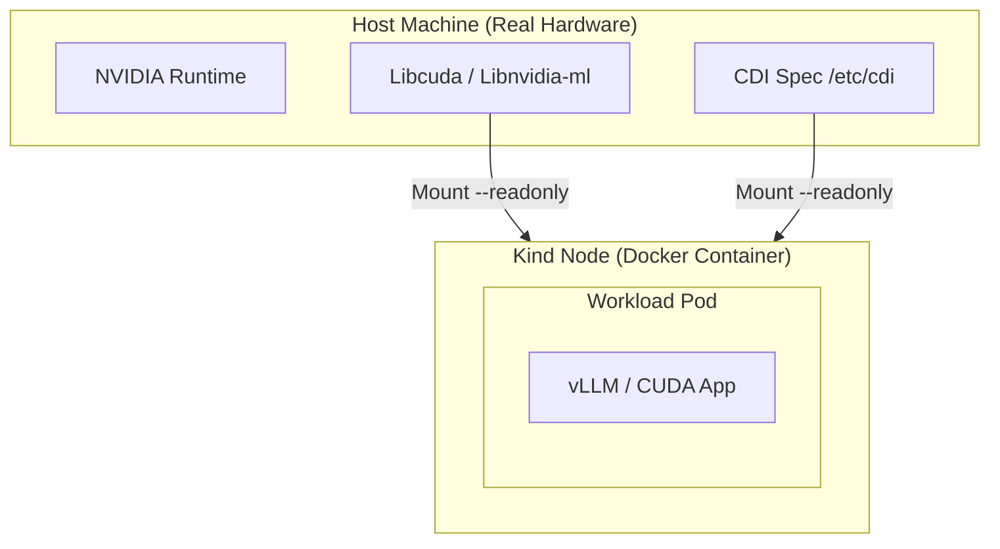

# Module 1: Kind Cluster Setup (GPU Library Pass-through)

## 1. Overview
In this module, we construct a specialized Kubernetes cluster with GPU access.
Standard Kind clusters are "Docker-in-Docker" environments. They isolate the Node from the Host's GPU runtime. To enable GPU workloads and DRA, we must mount the host NVIDIA libraries into the Kind node.

## 2. Architecture: GPU Library Pass-through

In a Kind environment, the Kind node is a Docker container that doesn't have direct access to host GPU libraries. We solve this by mounting host NVIDIA libraries and the CDI spec into the Kind node:


```mermaid
flowchart TD
    subgraph Host ["Host Machine (Real Hardware)"]
        RT[NVIDIA Runtime]
        LIB[Libcuda / Libnvidia-ml]
        CDI[CDI Spec /etc/cdi]
    end

    subgraph KindNode ["Kind Node (Docker Container)"]
        subgraph Pod ["Workload Pod"]
            App[vLLM / CUDA App]
        end
    end

    LIB -->|Mount --readonly| KindNode
    CDI -->|Mount --readonly| KindNode
```

## 3. Implementation Logic

We use `scripts/phase1/run-module1-setup-kind.sh` to automate this complex setup.

### 3.1. Dynamic Config Generation
The script invokes `helper-generate-kind-config.sh`, which performs a "Host Inspection":
1.  **Locate Libraries**: Finds where `libnvidia-ml.so`, `libcuda.so`, and `libnvidia-ptxjitcompiler.so` live on your specific OS.
2.  **Generate `extraMounts`**: Writes a `kind-config.yaml` that maps these host paths to uniform locations inside the Kind node (e.g., `/usr/lib/x86_64-linux-gnu/`).

## 4. Verification

After execution, verify that the Kind node can see the GPU:

**Command:**
```bash
docker exec workshop-dra-control-plane nvidia-smi
```

### Common Failure Modes
1.  **"Library not found" inside Node**: The generate script failed to find the correct library path on the host. Check `manifests/module1/kind-config.yaml`.

## 5. References
- [Kind: Extra Mounts](https://kind.sigs.k8s.io/docs/user/configuration/#extra-mounts)
- [NVIDIA MPS Documentation](https://docs.nvidia.com/deploy/mps/index.html)
