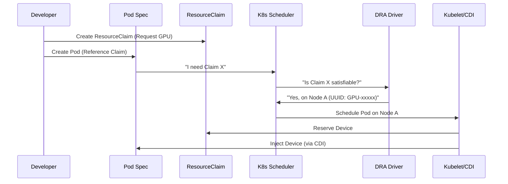

# Module 3: Basic Workload & DRA Mechanics

## 1. Overview
This module validates the fundamental "Claim-Bind-Run" cycle of Dynamic Resource Allocation.
Before attempting advanced features like MPS, we must confirm that the **Default Scope** (Exclusive Access) works as intended.

## 2. Default Behavior: Exclusive Access
In the current implementation of the NVIDIA DRA Driver, a GPU is treated as an **atomic, exclusive resource** unless configured otherwise (via MPS).
- **Scenario**: You have 1 Physical GPU.
- **Action**: You deploy `pod-1` claiming a GPU.
- **Result**: `pod-1` Runs. The GPU is LOCKED.
- **Action**: You deploy `pod-2` claiming a GPU.
- **Result**: `pod-2` Pends. No resources available.

This behavior contrasts with the classic Device Plugin, which often allowed oversubscription if not configured strictly, but DRA makes the availability explicit.

## 3. The DRA Workflow for Developers

Gone are the days of requests: `nvidia.com/gpu: 1`.
The new workflow decouples the **Need** (Pod) from the **Request** (Claim).



## 4. Manifest Deep Dive

Let's dissect `manifests/demo-gpu.yaml` to understand the binding.

### 4.1. The Claim
```yaml
apiVersion: resource.k8s.io/v1alpha2
kind: ResourceClaim
metadata:
  name: gpu-claim-1
spec:
  resourceClassName: gpu.nvidia.com  # 1. Selects the Driver
```

### 4.2. The Pod
```yaml
apiVersion: v1
kind: Pod
metadata:
  name: pod-gpu-1
spec:
  containers:
  - name: ctr
    image: nvidia/cuda:11.7.1-base-ubuntu22.04
    command: ["/bin/bash", "-c", "nvidia-smi && sleep 3600"]
    resources:
      claims:
      - name: claim-1              # 2. Defines a local name for the claim
  resourceClaims:
  - name: claim-1                  # 3. Maps local name to external object
    resourceClaimName: gpu-claim-1 # 4. References the ResourceClaim above
```

## 5. Verification

Run the automated verification:
```bash
./scripts/phase1/run-module3-verify-workload.sh
```

### Success Indicators
1.  `pod-gpu-1` status becomes `Running`.
2.  `nvidia-smi` inside the pod shows the GPU.
3.  `pod-gpu-2` (if deployed on single-GPU node) typically remains `Pending` (SchedulingGated), proving the scheduler correctly tracks the GPU as "Occupied".

## 6. Official References
- [Kubernetes Docs: ResourceClaims](https://kubernetes.io/docs/concepts/scheduling-eviction/dynamic-resource-allocation/)
