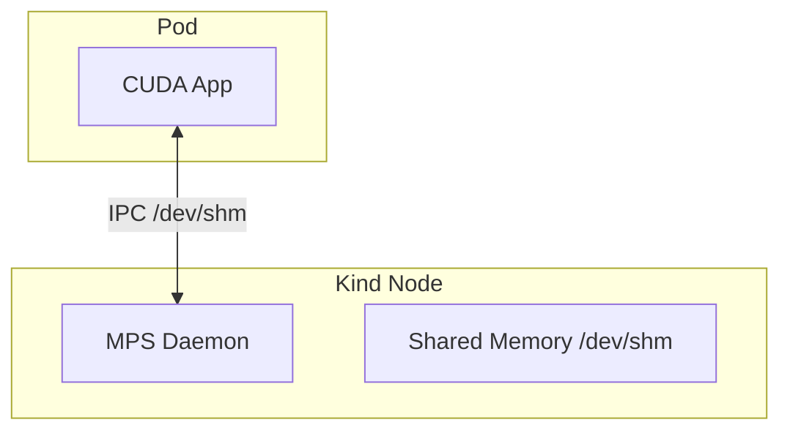

# Module 4: MPS Basics (Enabling Spatial Sharing)

Now that we have verified exclusive access, we move to **Spatial Sharing**. This module verifies the infrastructure (IPC bridging) required to support multiple clients on a single GPU.

## 1. Goal
Confirm that a Pod can "see" and "talk" to the **In-Cluster MPS Daemon** running inside the Kind Node. If this fails, resource sharing (Module 5) will be impossible.

## 2. Architecture

We use `hostIPC: true` and mount `/dev/shm` to bridge the isolation gap.

## 3. Verification
Run the verification script:
```bash
./scripts/phase1/run-module4-mps-basics.sh
```

### What happens?
1. **Deploy Pod**: `mps-basic` (with `hostIPC: true`).
2. **Connectivity Check**: The script executes `echo ps | nvidia-cuda-mps-control` *inside* the Pod.
3. **Success Criteria**: If the Daemon responds with a process list (even empty), the connection is established. This proves the pipe `/tmp/nvidia-mps` and shared memory are correctly propagating from Node to Pod.

## 4. Troubleshooting
- **"Connection Refused"**: Usually means `/dev/shm` is not mounted shared or the daemon is dead.
  - Check Node daemon: `docker exec workshop-dra-control-plane ps aux | grep mps`
- **"File not found"**: The pipe directory `/tmp/nvidia-mps` might not be mounted. Check the Pod spec `volumeMounts`.
