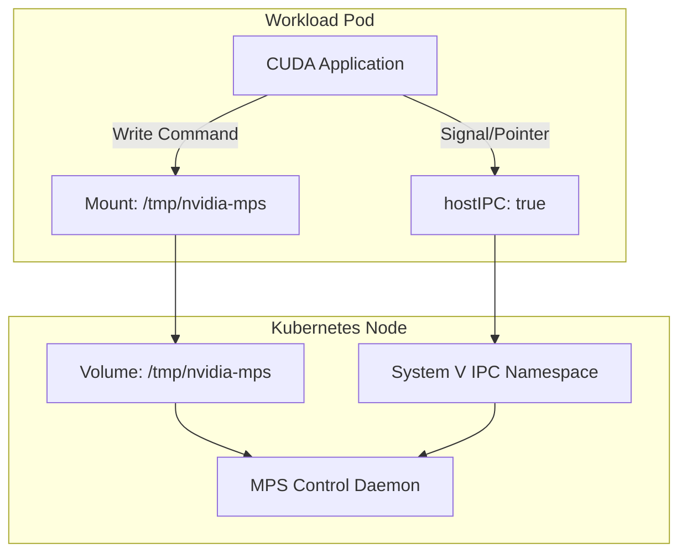

# Module 4: MPS Basics (Spatial Sharing)

## 1. Overview

**Multi-Process Service (MPS)** is a feature of the CUDA runtime that allows multiple processes (e.g., separate Kubernetes Pods) to share the same GPU Context.
This module verifies the infrastructure "plumbing" required to make MPS work in a containerized environment.

### Why MPS in Kubernetes?
By default, CUDA contexts are expensive. Time-slicing (the default sharing mode without MPS) incurs high context-switching overhead.
MPS acts as a **Funnel**:
- It aggregates CUDA commands from all client processes.
- It submits them to the GPU as a single context.
- Result: **Spatial Sharing** (Concurrent Kernel Execution) and reduced overhead.

## 2. Architecture: The IPC Bridge

For a client (Pod) to "join" the MPS session, it must communicate with the MPS Control Daemon. This requires two things:

1.  **Command Channel**: A named pipe/socket at `/tmp/nvidia-mps` (Filesystem).
2.  **Coordination Channel**: **System V IPC** (Shared Memory/Semaphores) to exchange memory pointers and signals.

*Note: While many CUDA apps also need `/dev/shm` (POSIX Shared Memory) for their own internal performance (e.g., PyTorch DataLoaders), the critical bridge for MPS is the System V IPC Namespace.*



## 3. The "In-Cluster" Challenge

In the DRA Driver, configuring a ResourceClaim with "sharing enabled" triggers the driver to essentially "unlock" the GPU.
However, **the Pod Spec is critical here**.
The Driver does **not** automatically mount `/dev/shm` for you (security reasons). You must explicitly configure your Pod.

### 4. Manifest Analysis (`manifests/demo-mps-basics.yaml`)

```yaml
apiVersion: v1
kind: Pod
metadata:
  name: mps-basic
spec:
  hostIPC: true  # <--- CRITICAL: Required to share IPC namespace with Node
  containers:
  - name: ctr
    image: nvidia/cuda:11.7.1-base-ubuntu22.04
    volumeMounts:
    - name: mps-pipe
      mountPath: /tmp/nvidia-mps # The Command Channel
    - name: dshm
      mountPath: /dev/shm        # The Data Channel
  volumes:
  - name: mps-pipe
    hostPath:
      path: /tmp/nvidia-mps
  - name: dshm
    emptyDir:
      medium: Memory
```

*Note: In our Kind setup, we use `hostPath` to mount the pipe that we exposed in Module 1.*

## 5. Verification

This module performs a **Connectivity Check**. It does not run a heavy workload yet (that's Module 6); it just checks "dial tone".

**Command:**
```bash
./scripts/phase1/run-module4-mps-basics.sh
```

**What it does:**
1.  Enters the Pod.
2.  Runs `echo ps | nvidia-cuda-mps-control`.
3.  If the connection is valid, the daemon replies with a list of active processes (or an empty list).
4.  If the connection is broken, it typically hangs or returns "Connection Refused".

## 6. Troubleshooting

### "Transport endpoint is not connected"
- **Cause**: The MPS Daemon inside the Kind Node has died or wasn't started.
- **Fix**: Check Module 1 verification. Restart the daemon inside the node.

### "Connection Refused"
- **Cause**: Permission issues on `/tmp/nvidia-mps` or mismatched IPC namespaces.
- **Check**: Ensure `hostIPC: true` is set in the Pod.

## 7. Resources
- [NVIDIA MPS Documentation - Architecture](https://docs.nvidia.com/deploy/mps/index.html#topic_3_2)
