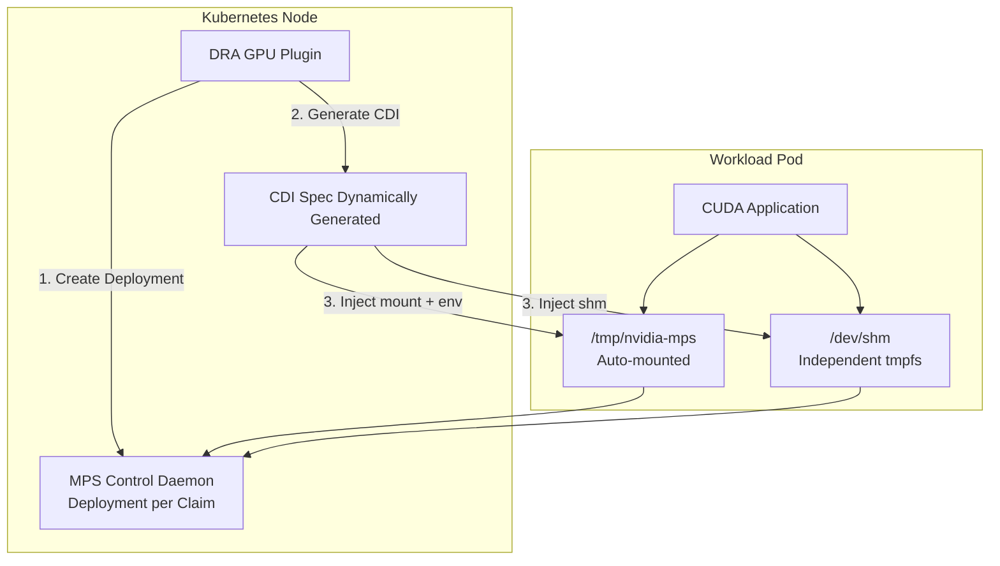

# Module 4: DRA-Managed MPS Basics (Experimental)

## 1. Overview

MPS (Multi-Process Service) enables multiple Pods to share a single GPU concurrently. The NVIDIA DRA GPU Driver's `MPSSupport` feature gate provides native MPS management — the DRA Driver fully manages the MPS daemon lifecycle, so the Pod Spec requires no special configuration.

## 2. Architecture: Driver-Managed MPS

The architecture of DRA-managed MPS is as follows:


```mermaid
graph TD
    subgraph "Kubernetes Node"
        Driver[DRA GPU Plugin]
        Deploy["MPS Control Daemon<br/>Deployment per Claim"]
        CDI[CDI Spec Dynamically Generated]
    end

    subgraph "Workload Pod"
        App[CUDA Application]
        Pipe["/tmp/nvidia-mps<br/>Auto-mounted"]
        Shm["/dev/shm<br/>Independent tmpfs"]
    end

    Driver -->|"1. Create Deployment"| Deploy
    Driver -->|"2. Generate CDI"| CDI
    CDI -->|"3. Inject mount + env"| Pipe
    CDI -->|"3. Inject shm"| Shm
    App --> Pipe --> Deploy
    App --> Shm --> Deploy
```

### What DRA Driver Handles Automatically

| Step | DRA-managed MPS Behavior |
|------|--------------------------|
| MPS Daemon Startup | Driver creates Deployment `mps-control-daemon-{id}` |
| Compute Mode | Driver automatically sets to `EXCLUSIVE_PROCESS` |
| MPS Pipe Mount | CDI automatically bind mounts + injects `CUDA_MPS_PIPE_DIRECTORY` env |
| IPC Channel | CDI mounts independent tmpfs to `/dev/shm` (per-claim isolation) |
| Daemon Lifecycle | Started/Destroyed per Claim, auto-cleaned on Claim release |

## 3. Manifest Analysis

### ResourceClaim with MPS

```yaml
apiVersion: resource.k8s.io/v1
kind: ResourceClaim
metadata:
  name: gpu-claim-dra-mps
spec:
  devices:
    config:
    - opaque:
        driver: gpu.nvidia.com
        parameters:
          apiVersion: resource.nvidia.com/v1beta1
          kind: GpuConfig
          sharing:
            strategy: MPS           # Tells Driver to enable MPS
    requests:
    - name: gpu-req
      exactly:
        count: 1
        deviceClassName: gpu.nvidia.com
---
apiVersion: v1
kind: Pod
metadata:
  name: dra-mps-basic-1
spec:
  containers:
  - name: cuda-container
    image: nvidia/cuda:12.3.1-devel-ubuntu22.04
    command: ["sh", "-c", "nvidia-smi; sleep 3600"]
    resources:
      claims: [{name: gpu}]
  resourceClaims: [{name: gpu, resourceClaimName: gpu-claim-dra-mps}]
```

The Pod spec requires no special MPS configuration — everything is handled by the DRA Driver via the ResourceClaim.

### Multi-Pod Sharing

Multiple Pods can share the same MPS daemon on a single GPU by referencing the same ResourceClaim:

```yaml
# Pod 1 and Pod 2 both reference the same claim
resourceClaims: [{name: gpu, resourceClaimName: gpu-claim-dra-mps}]
```

## 4. Prerequisites

1. **Kind cluster established** (Module 1) with DRA Driver installed (Module 2).
2. **MPSSupport feature gate enabled**:
   ```bash
   # How to verify
   kubectl get ds -n nvidia-system nvidia-dra-driver-gpu-kubelet-plugin -o json \
     | grep "MPSSupport=true"

   # How to enable (if not already enabled)
   kubectl patch ds -n nvidia-system nvidia-dra-driver-gpu-kubelet-plugin \
     --type strategic -p "$(cat manifests/module7/patch-driver-featuregate.yaml)"
   ```

## 5. Verification

```bash
./scripts/phase1/run-module4-mps-basics.sh
```

### Verification Items

| Item | Expected Result | Actual Result |
|------|-----------------|---------------|
| 2 Pods share the same GPU | Same UUID | ✅ `GPU-d675772b-...` |
| CDI injected `CUDA_MPS_PIPE_DIRECTORY` | `/tmp/nvidia-mps` | ✅ |
| MPS control pipe exists | `/tmp/nvidia-mps/control` | ✅ |
| `/dev/shm` independent tmpfs | Not Node's shm | ✅ 250G tmpfs |
| `hostIPC` | `false` | ✅ |

## 6. Driver Source Code Analysis

The implementation of MPS in the DRA Driver is located in `cmd/gpu-kubelet-plugin/sharing.go`:

1. **`MpsManager`**: Manages the lifecycle of the MPS control daemon.
2. **`MpsControlDaemon.Start()`**:
   - Creates `pipeDir`, `shmDir`, and `logDir`.
   - Sets the GPU compute mode to `EXCLUSIVE_PROCESS`.
   - Mounts an independent tmpfs to `shmDir`.
   - Creates the MPS Control Daemon **Deployment** from a template.
3. **`GetCDIContainerEdits()`**: Generates CDI injection rules.
   - Env var: `CUDA_MPS_PIPE_DIRECTORY=/tmp/nvidia-mps`.
   - Mount: `pipeDir` → `/tmp/nvidia-mps`.
   - Mount: `shmDir` → `/dev/shm`.

## 7. Troubleshooting

### Pod stuck in Pending
- **Cause**: `EXCLUSIVE_PROCESS` compute mode conflict. If another process on the Node is already using the GPU, the Driver cannot set the compute mode.
- **Fix**: Ensure no other Pod is exclusively using the GPU.

### MPS Pipe does not exist
- **Cause**: `MPSSupport` feature gate is not enabled, and the Driver ignored the `sharing.strategy: MPS` configuration.
- **Fix**: Confirm the feature gate is enabled (see Section 4).

### Claim allocated to MIG device instead of full GPU
- **Cause**: `deviceClassName: gpu.nvidia.com` might match a MIG device.
- **Fix**: Use a CEL selector to exclude MIG or ensure a full GPU is available in the environment.

## 8. Resources
- [NVIDIA DRA GPU Driver - MPS Support](https://github.com/NVIDIA/k8s-dra-driver-gpu)
- [NVIDIA MPS Documentation](https://docs.nvidia.com/deploy/mps/index.html)
