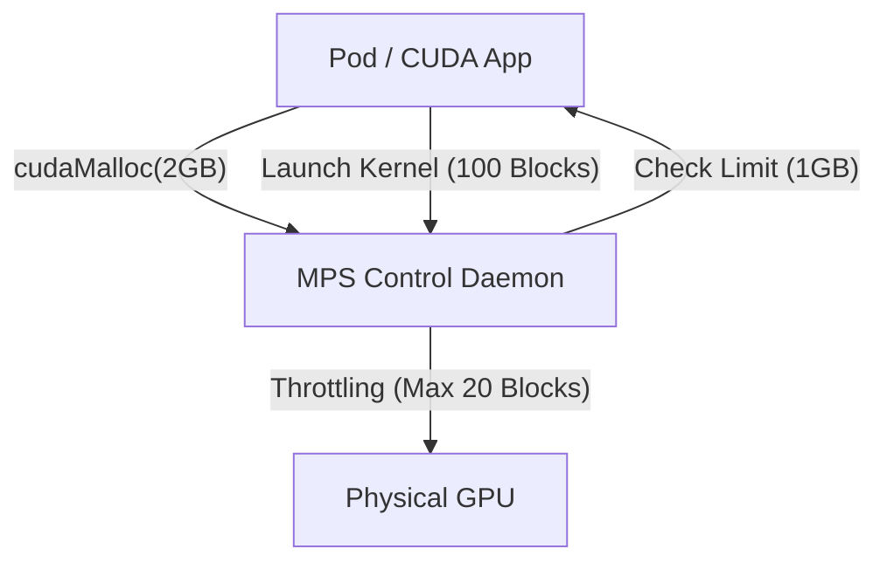

# Module 5: MPS Advanced (Resource Limits & QoS)

## 1. Overview

While Module 4 proved we *can* share a GPU, Module 5 proves we *should*.
Without limits, "Spatial Sharing" is just "Chaos". Any process can consume 100% of the memory or compute, starving others.
This module verifies **Active Resource Partitioning**, ensuring that tenants (Pods) are strictly confined to their allocated quotas.   

## 2. Technical Architecture

MPS enforces limits via a **Server-Client Interception Model**.



### 2.1. The Control Knobs
The DRA Driver injects these environment variables into the Pod. The MPS Client Runtime reads them during initialization (`cudaInit`).

| Variable                            | Function              | Mechanism                                                |
| :---------------------------------- | :-------------------- | :------------------------------------------------------- |
| `CUDA_MPS_PINNED_DEVICE_MEM_LIMIT`  | **Memory Hard Limit** | If `alloc > limit`, return error. Protects against OOM.  |
| `CUDA_MPS_ACTIVE_THREAD_PERCENTAGE` | **Compute Limit**     | Restricts the number of SMs (Streaming Multiprocessors). |

## 3. Implementation Verification

We use `scripts/phase1/run-module5-mps-advanced.sh`.
This script is a comprehensive **Integration Test** that:

1.  **Deploys a Limited Pod**:
    -   Manifest: `manifests/demo-mps-limits.yaml`
    -   Claim: "20% Compute, 1GB Memory"
2.  **Validates Configuration**:
    -   Checks if env vars are correctly injected by the driver.
3.  **Compiles & Runs Stress Test**:
    -   We compile a custom CUDA C++ program *inside* the Pod to perform precise allocation tests.

### Code Analysis: The Stress Test
The test program (`/tmp/mps_test.cu` generated by the script) is simple:
```cpp
cudaMalloc(&ptr, size);
if (success) print("Allocated");
else print("Failed");
```

## 4. Execution & Results

Run the verification:
```bash
./scripts/phase1/run-module5-mps-advanced.sh
```

### Expected Output Anatomy
1.  **Sanity Check (100MB)**:
    > "Allocated 100MB successfully"
    *Meaning*: The MPS connection is healthy, and we are within limits.

2.  **OOM Test (2GB)**:
    > "Allocation failed: out of memory"
    *Meaning*: **SUCCESS**. The system prevented the app from exceeding its 1GB limit. If this said "Allocated 2GB successfully", the test would be a **FAILURE** (Safety breach).

## 5. Advanced: Performance Sensitivity (Module 6.5 Preview)
While Module 5 verifies *functionality* (Caps), Module 6.5 checks *performance* (Latency).
We found that while **Throughput** is relatively robust to limits, **Latency (TTFT)** is highly sensitive to the Active Thread Percentage.
*See Module 6 for details.*

## 6. references
- [NVIDIA MPS Resource Limits](https://docs.nvidia.com/deploy/mps/index.html#topic_5_1_1)
