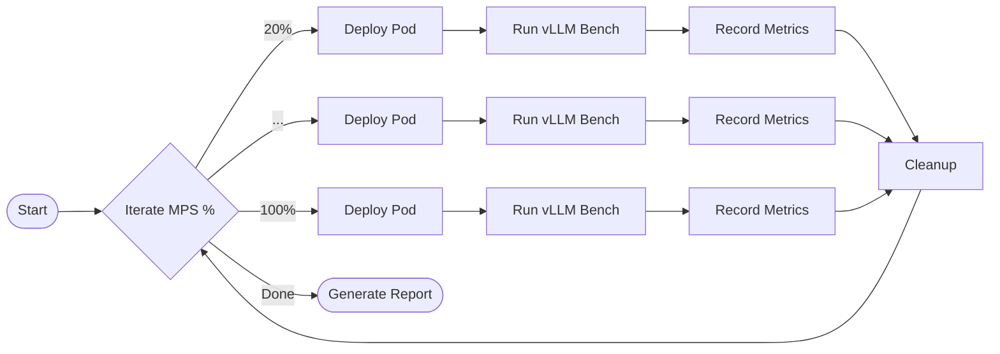

# Module 6.5: vLLM Performance Sensitivity Analysis

## 1. Overview
This module is an advanced experiment designed to explore the specific impact of different MPS (Multi-Process Service) **Active Thread Percentage** limits on LLM inference performance.
We conduct a **Sensitivity Analysis** to observe performance metrics (Throughput, TTFT, ITL) under various `CUDA_MPS_ACTIVE_THREAD_PERCENTAGE` settings.

### Research Question
> *How much compute (SMs) does an LLM actually need to maintain decent latency?*

## 2. Experiment Design

We execute an automated loop test to measure performance.



- **Variable**: `CUDA_MPS_ACTIVE_THREAD_PERCENTAGE` (20, 40, 60, 80, 100).
- **Fixed**:
    - Model: `Qwen/Qwen2.5-1.5B-Instruct`
    - Dataset: `ShareGPT`
    - Request Rate: 4.0 req/s

## 3. Implementation

We provide an automated script to execute the verification process:
```bash
./scripts/phase1/run-module6-vllm-experiment.sh
```

The script generates a CSV report at `/tmp/vllm_benchmark_results.csv`.

## 4. Analysis of Results

The following data (derived from our Lab baseline on RTX 4090) illustrates the non-linear relationship between Compute and Latency.

| MPS Limit | Throughput (req/s) | Mean TTFT (ms) | Mean ITL (ms) | Impact           |
| :-------- | :----------------- | :------------- | :------------ | :--------------- |
| **20%**   | **3.47**           | **42.97**      | **7.00**      | **High Latency** |
| **40%**   | 3.56               | 25.50          | 5.77          | Balanced         |
| **60%**   | 3.57               | 21.12          | 5.50          | Good             |
| **80%**   | 3.58               | 17.95          | 5.25          | Excellent        |
| **100%**  | 3.57               | 17.21          | 5.48          | Baseline         |

### Key Insights

1.  **Throughput is Robust**: Even at 20% compute, throughput remains stable (~3.5 req/s). This implies the workload is **not throughput-bound** by compute at this concurrency level.
2.  **Latency is Sensitive**:
    -   **TTFT (Time To First Token)**: Increases by **2.5x** when dropping from 100% to 20%. The Prefill phase is heavily compute-bound.
    -   **ITL (Inter-Token Latency)**: P99 ITL spikes at 20%, causing "stuttering" generation.

### Conclusion for Platform Engineers
-   **For Background Batch Jobs**: You can safely limit MPS to 20-30% to save resources for other tasks; throughput won't suffer much.
-   **For Interactive Chat**: You should allocate at least **40-50%** compute to keep latency (TTFT/ITL) within acceptable "Human-Perceived" limits.

## 5. References
-   [vLLM Benchmarking Guide](https://docs.vllm.ai/en/latest/serving/benchmark.html)
