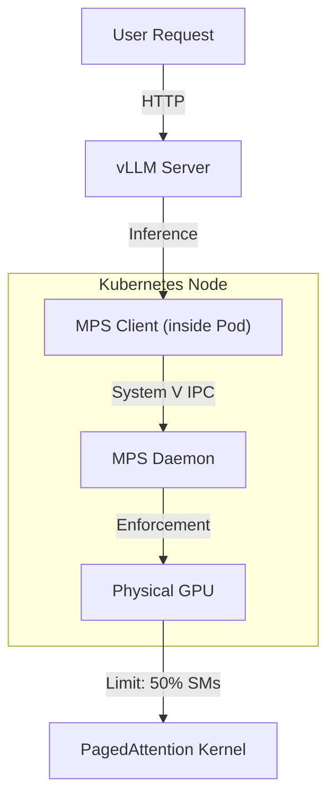

# Module 6: vLLM Verification (Real-World Workload)

## 1. Overview

Thus far, we have verified MPS using synthetic CUDA benchmarks. Now, we face the "Final Boss": **vLLM**, a high-performance LLM inference engine.
This module verifies that a complex, production-grade AI workload can run stably under the MPS constraints we established.

### Why vLLM?
-   It uses advanced CUDA features (PagedAttention, CUDA Graphs).
-   It is sensitive to memory availability (allocates KVCache aggressively).
-   If MPS is broken or limits are handled incorrectly, vLLM will crash immediately.

## 2. Technical Architecture

We deploy vLLM with a **50% Compute Limit**.



## 3. Implementation Details

We use `scripts/phase1/run-module6-vllm-verify.sh`.

### 3.1. The Workload
-   **Model**: `Qwen/Qwen2.5-1.5B-Instruct` (Small enough for workshop GPUs, representative architecture).
-   **Configuration**:
    -   `gpu-memory-utilization`: 0.9 (Aggressive VRAM usage).
    -   `MPS Active Thread Percentage`: **50%**.

### 3.2. Verification Flow
1.  **Deployment**: Creates a Pod with a custom ResourceClaim.
2.  **Health Check**: Polls `http://localhost:8000/health`.
3.  **Inference**: Sends a completion request ("Hello, Kubernetes!").

## 4. Execution & Verification

Run the verification:
```bash
./scripts/phase1/run-module6-vllm-verify.sh
```

### Success Criteria
1.  **Deployment Success**: Pod reaches `Running` state.
2.  **Server Healthy**: vLLM initialization completes (can take 1-2 mins to load weights).
3.  **Inference Output**:
    ```json
    {
        "model": "Qwen/Qwen2.5-1.5B-Instruct",
        "choices": [{ "text": "..." }]
    }
    ```
    > "✅ Verification Successful: vLLM generated text under MPS constraints."

## 5. Troubleshooting

### "Worker initialization failed: CUDA error"
-   **Cause**: MPS Pipe not mounted or permissions issue.
-   **Fix**: Check Module 4 verification.

### "OOM / Out of Memory"
-   **Cause**: The GPU has insufficient VRAM for the 1.5B model + KVCache.
-   **Fix**: Reduce `gpu-memory-utilization` in the script/manifest or check if other processes are hogging the GPU (run `nvidia-smi` on host).

### "Timeout waiting for vLLM server"
-   **Cause**: Model download is slow or MPS throttling is too aggressive (e.g., <10%).
-   **Fix**: Check pod logs: `kubectl logs vllm-server`.

## 6. References
-   [vLLM Documentation](https://docs.vllm.ai/en/latest/)
-   [NVIDIA MPS: Volta+ Architectures](https://docs.nvidia.com/deploy/mps/index.html)
